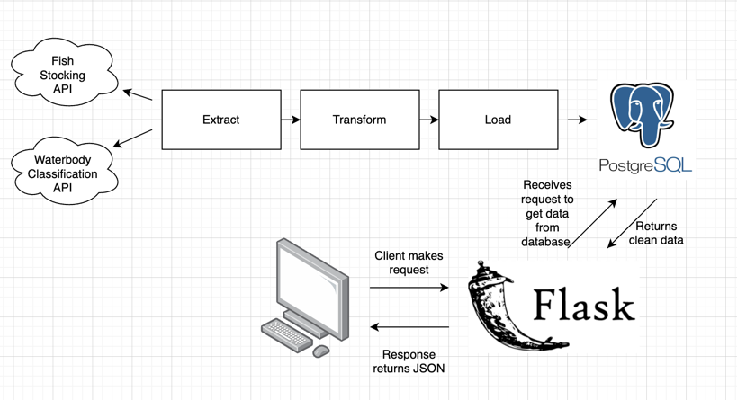
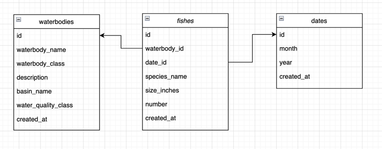

# Fish Stocking | Data Engineering Project

## Introduction
The purpose of this project is to study the restocking of fish in New York waterbodies. 
We want to study what types of fish species that usually get restocked in the New York waterbodies.
Does key factors like the size of fishes, the date when the fishes were added to the waterbodies, 
the waterquality of the waterbodies or location come into play?

## Architecture

## Technology Used
- Programming Language - Python, SQL
- Relational Database - PostgreSQL

## Dataset Used
1. Fish Stocking API: The Department of Environmental Conservation (DEC) 
stocks approximately 900,000 pounds of fish 
into more than 1,200 public streams, rivers, lakes and ponds across the state. 
Also included in the data are public stockings by Essex, Onondaga and Warren counties. 
    https://data.ny.gov/Recreation/Fish-Stocking-Lists-Actual-Beginning-2011/e52k-ymww
2. Waterbody Classifications API: This data set provides the water quality classifications of 
New York State's lakes, rivers, streams and ponds, collectively referred to as waterbodies. 
All water bodies in the state are provided a water quality classification based on existing, 
or expected best usage, of each waterbody or waterbody segment.
    https://data.ny.gov/Energy-Environment/Waterbody-Classifications/8xz8-5u5u

## Data Model

